# Azure Detect Secrets

# Table of Contents
- [Introduction](#introduction)
- [How to use dev container with your project](#how-to-use-dev-container-with-your-project)
- [How to use detect-secrets to detect specific Azure secrets in your source code](#how-to-use-detect-secrets-to-detect-specific-azure-secrets-in-your-source-code)
- [How to detect-secrets in Azure DevOps pipelines](#how-to-detect-secrets-in-azure-devops-pipelines)
- [How to detect-secrets in Github Action pipelines](#how-to-detect-secrets-in-github-action-pipelines)
- [Detect-secrets Integration Test](detect-secrets-integration-test)
- [Next steps](#next-steps)

## Introduction
This repository contains:  
1. python plugins samples to extend [yelp/detect-secrets](https://github.com/Yelp/detect-secrets) to detect Azure Secrets (Shared Access Signature Token, Databricks Token, Azure Storage Key,...) within your source code.
2. Github Action pipeline to scan secrets in the source code in the repository
3. Azure DevOps pipeline to scan secrets in the source code in the repository
4. A Visual Studio Code dev container where detect-secrets is pre-installed to check whether the source code pushed to your repository with command 'git push' doesn't contain any secrets.

Moreover, this documentation will cover the following topics:

1. How to use dev container with Visual Studio Code
2. How to install and configure detect-secrets to detect specific Azure secrets in your source code
3. How to create Github Action to detect secrets
4. How to create Azure DevOps pipeline to detect secrets
5. How to configure your Visual Studio Code environment to detect Azure secrets

This detect-secrets extensibility to detect Azure secrets has been used during a Data Science project which is described here https://aka.ms/hat-sharing.

## How to use dev container with your project 
In order to use efficiently detect-secrets in a project using Visual Studio Code, it's recommended to use dev container which will provide the same development environment to the developers team.
Moreover, the dev container will ensure the all the deveoppers have the same environment for the github pre-commit hook used by detect-secrets.

With Visual Studio Code Remote Containers, the advantages are massive: 
- It is very easy to repeatedly provision the same coding environment in seconds.
- The coding environment itself can easily be adjusted and configured. This environment can be version controlled alongside the rest of the project.
- Whenever changes are made to the development environment, a developer can rebuild the container to have the newest changes and settings applied.
- It removes any versioning issues that can easily arise from installing items on different machines at different times.

The dev container in this repository contains a subfolder .devcontainer containing all the files required to build a dev container with Visual Studio Code.

### Installing the pre-requisites
Before you start to clone the repository on your machine, make sure your computer meets the following requirements:
- Operating System
  - [Windows 10 with WSL2](https://docs.microsoft.com/en-us/windows/wsl/install-win10)
  - Linux
  - macOS
- Docker
  - [Docker Desktop for Mac](https://hub.docker.com/editions/community/docker-ce-desktop-mac)
  - [Docker Desktop for Windows 10](https://hub.docker.com/editions/community/docker-ce-desktop-windows)
- [Visual Studio Code](https://code.visualstudio.com/)
  - [VSCode Remote - Containers extension](https://marketplace.visualstudio.com/items?itemName=ms-vscode-remote.remote-containers)
  - As the new devcontainer implementation requires you can also run Visual Studio Code from the terminal (Linux, MacOS) or from the Command Shell (Windows) by typing 'code', don't forget those configuration steps on MacOS:
    - Launch VS Code.
    - Open the Command Palette (Ctrl+Shift+P) and type 'shell command' to find the "Shell Command: Install 'code' command in PATH" command.  
    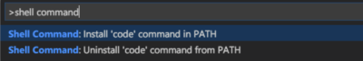
    - Restart the terminal for the new $PATH value to take effect. You'll be able to type 'code .' in any folder to start editing files in that folder.  

### Cloning this repository

Once all the pre-requisites are installed, you can clone this repository to download the source code and the dev container .

1. Clone the github repository  https://github.com/flecoqui/azure-detect-secrets.git using the following command line:

```bash
    C:\git> git clone https://github.com/flecoqui/azure-detect-secrets.git
```
2. Launch Visual Studio Code running the following command line:

```bash
    C:\git> cd azure-detect-secrets
    C:\git\azure-detect-secrets> code .
```

3. Once Visual Studio Code is launched, after few seconds a popup dialog box is displayed, asking to reopen the project in container mode, click on the button "Reopen in container"  
    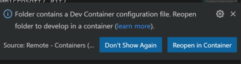
4.  The Visual Studio Code will reopen the project in container mode. Click on the link "Starting Dev Container (show logs)" to display the logs.  
    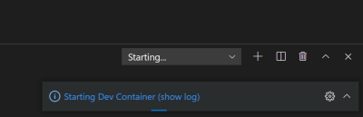
5.  After few minutes, the dev container is ready and you can open a terminal:  
    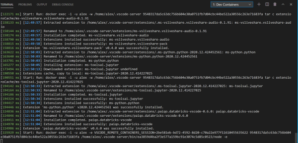
6.  Select the submenu "New Terminal" in the menu "Terminal" to open a terminal with the dev container:  
    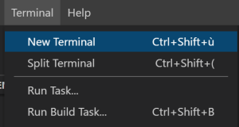
7. In the new terminal, you can use linux commands to manage your repository:  
    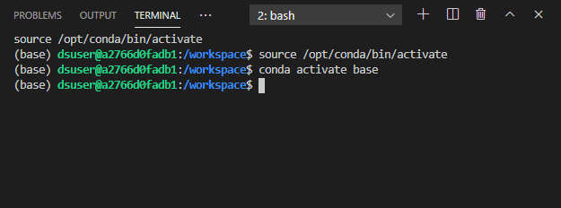

Your environment is now ready to use detect-secrets.


## How to use detect-secrets to detect specific Azure secrets in your source code

### Installing detect-secrets

By default, detect-secrets is installed and configured to detect specific Azure secrets in the dev container in this repository. 

But, if you want to reinstall detect-secrets, you need an environment where python and pip are already installed.
Then you can run the following command to install detect-secrets: 

```bash
 pip install tox==3.21.3 pre-commit==2.10.0  detect-secrets==1.0.3
```

The source code of the pluins are available under folder 'pipelines/detect-secrets/plugins'.

### Azure secrets plugins

The plugins used to detect specific Azure secrets are available in the current repository under 'pipelines/detect-secrets/plugins'.

Below some examples of Azure plugins:

For instance: [Plugin source code](./pipelines/detect-secrets/plugins/azuredatabrickstoken.py) to detect Azure Databricks Token

```python

import re

from detect_secrets.plugins.base import RegexBasedDetector


class AzureDatabricksTokenDetector(RegexBasedDetector):
    """Scans for Azure Databricks Token."""

    secret_type = "Azure Databricks Token"

    denylist = [
        re.compile(r"\b([0-9a-z]{36})\b"),
    ]

```

For instance: [Plugin source code](./pipelines/detect-secrets/plugins/azurestoragekey.py) to detect Azure Storage Key
```python
import re

from detect_secrets.plugins.base import RegexBasedDetector


class AzureDataLakeStorageKeyDetector(RegexBasedDetector):
    """Scans for Azure Data Lake Storage Access keys."""

    secret_type = "Azure Data Lake Storage Access Key"

    denylist = [
        re.compile(r"\b([\/\+0-9a-zA-Z]{86})\b=="),
    ]
```


For instance: [Plugin source code](./pipelines/detect-secrets/plugins/azuresas.py) to detect Azure Shared Access Signature Token
```python
import re

from detect_secrets.plugins.base import RegexBasedDetector


class AzureSASTokenDetector(RegexBasedDetector):
    """Scans for Azure SAS Token."""

    secret_type = "Azure SAS Token"

    denylist = [
        re.compile(r"(?=.*sv=*)(?=.*&se=*)(?=.*&sig=[\%0-9a-zA-Z]{20})"),
    ]

```
Moreover in order to test the plugins the file [tests.txt](./pipelines/detect-secrets/plugins/tests/tests.txt) contains several Azure secrets. As this file contains fake secrets, it will be excluded from the list of files to be scanned. 
At least, this repository contains the source code of a sample python package used to upload and download content of blobs in Azure Storage Account. The unit tests of this python package are also available in this repository. The file [config.py](./tests/blobtext/config.py) used for the unit tests contains also some fake Azure secrets to run the tests.

### Configuring detect-secrets

Now you need to configure detect-secrets, first you need to store in the file 'configs/.detect-secrets.cfg' the version of detect-secrets used. You need to define the value of variable 'DETECT_SECRETS_BRANCH_VERSION'. This value will be used by either Azure DevOps pipeline or github actions to install the correct version of detect-secrets. Moreover, if the installation of the detect-secrets is required in the dev container, the dev container will check the version in this file.  
For instance:

```python
DETECT_SECRETS_BRANCH_VERSION=1.0.3
```

Once, the detect-secrets version is defined, you can define the list of allowed secrets in the source code in your repository. 
Maybe you can check the secrets already present in the repository running the following commands:

```bash
    rm .secrets.baseline
    pipelines/utils/scan-secrets.sh 
```
The file .secrets.baseline contains the list of allowed secrets, as this file has been removed, this list is now empty. The bash file scan-secrets.sh will return the list of secrets detected in the repository. 

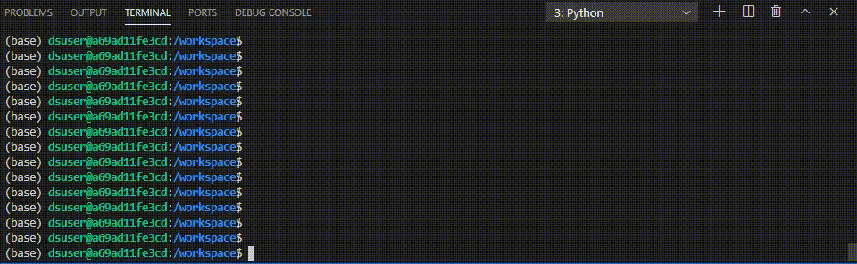

If the bash file scan-secrets.sh returns a list of secrets and you think those secrets can stay in the repository, run the following command:  

```bash
    pipelines/utils/generate-scan-secrets-config-files.sh 
```
This bash file will update the file .secrets.baseline.

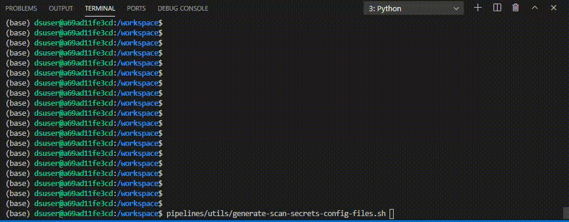

Moroever, this bash file will create a file called .pre-commit-config.yaml and instal a github pre-commit hook to check if there are any secrets in the source code which will be committed in the repository.  
Once the pre-commit hook is installed, all the git commit including new secrets in the source code will be blocked:

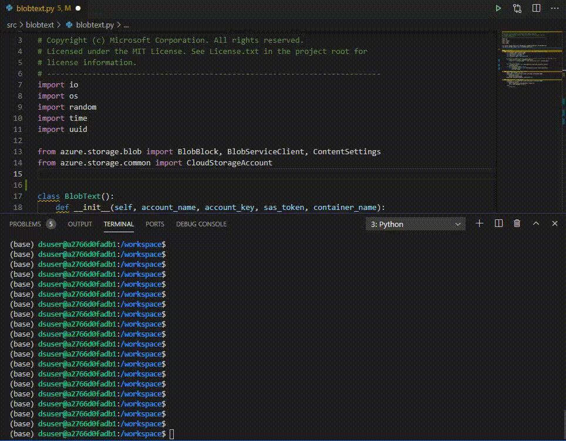

Moreover, with the current configuration the secrets in a file whose path contains "tests' will be accepted. For instance the file 'pipelines/detect-secrets/plugins/tests/tests.txt' contains a list of secrets which could be used for tests purposes.

The bash file 'pipelines/utils/generate-scan-secrets-config-files.sh' run the following command to generate the .secrets.baseline file. The command depends on the version of detect-secrets.

For instance when detect-secrets version < 1 :

```text
        detect-secrets scan --custom-plugins ./utils/secrets-check/plugins/ ./ --exclude-files ".*/tests/.*|.secrets.baseline|\.env|__pycache__|\.vscode|\.pytest_cache|\.mypy_cache|\.git|^build|^dist|\.ipynb_checkpoints" --no-basic-auth-scan  --no-keyword-scan  > .secrets.baseline    
```

  For instance when detect-secrets version >= 1 :

```text
        detect-secrets scan --plugin ./utils/secrets-check/plugins/azuresas.py --plugin ./utils/secrets-check/plugins/azuredatabrickstoken.py --plugin ./utils/secrets-check/plugins/azurestoragekey.py  ./  --exclude-files ".*/tests/.*|.secrets.baseline|\.env|__pycache__|\.vscode|\.pytest_cache|\.mypy_cache|\.git|^build|^dist|\.ipynb_checkpoints" --disable-plugin KeywordDetector --disable-plugin BasicAuthDetector --disable-filter  detect_secrets.filters.heuristic.is_prefixed_with_dollar_sign --disable-filter  detect_secrets.filters.heuristic.is_sequential_string  --disable-filter   detect_secrets.filters.heuristic.is_templated_secret > .secrets.baseline    
```

For detect-secrets version 1.0.3 the following filters need to be disabled to detect custom Azure Storage SAS Token:
 - detect_secrets.filters.heuristic.is_prefixed_with_dollar_sign
 - detect_secrets.filters.heuristic.is_sequential_string
 - detect_secrets.filters.heuristic.is_templated_secret


## How to detect-secrets in Azure DevOps pipelines
Once the bash file 'pipelines/utils/scan-secrets.sh' is running in your dev container. You could run the same bash file in an Azure DevOps pipeline triggered manually or each time the main branch is updated.

In this repository there are two Azure DevOps pipelines:
1. A detect secret pipeline [pipelines/azure-dev-ops/azure-pipelines.scan-secrets.yml](pipelines/azure-dev-ops/azure-pipelines.scan-secrets.yml)
2. A Continuous Integration pipeline which detect secrets, build the package, install the package and test the package [pipelines/azure-dev-ops/azure-pipelines.ci.yml](pipelines/azure-dev-ops/azure-pipelines.ci.yml)


In order to use the Continuous Integration pipeline, you need to create a variable group 'storage-variables' which defines the Azure Storage input parameters.

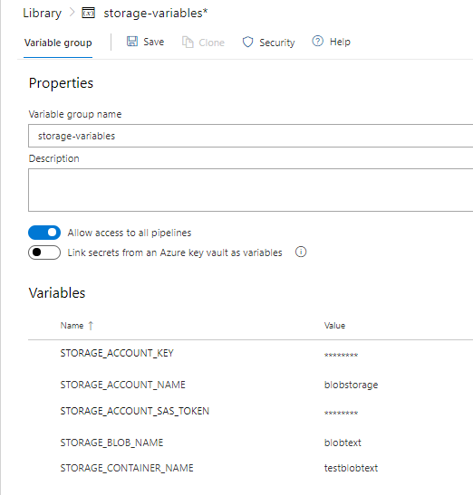


Below the information to enter in the variable group:
| Variables | Description |
| ---------------------|:-------------|
| STORAGE_ACCOUNT_NAME | Azure Storage Account name used for the tests |
| STORAGE_ACCOUNT_KEY | Azure Storage Account key used for the tests |
| STORAGE_CONTAINER_NAME | Azure Storage Container name used for the tests |
| STORAGE_BLOB_NAME | Azure Storage blob name used for the tests |
| STORAGE_ACCOUNT_SAS_TOKEN | Azure Storage Shared Access Signature Token used for the tests |

Once the pipeline is created on your Azure DevOps portal, you'll see the following result:

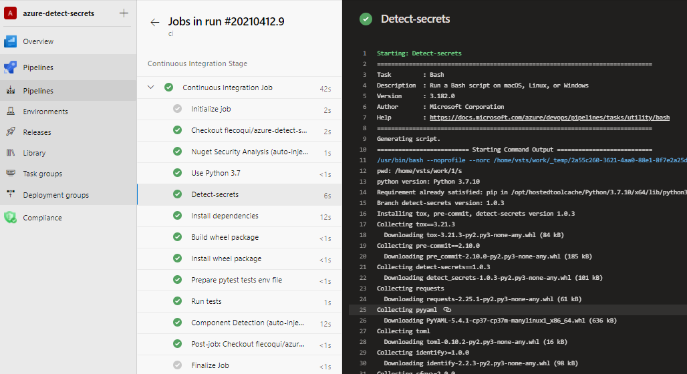


## How to detect-secrets in Github Action pipelines
Once the bash file 'pipelines/utils/scan-secrets.sh' is running in your dev container. You could run the same bash file in Github Actions pipeline triggered manually or each time the main branch is updated.

In this repository there are two Github Actions pipelines:
1. A detect secret pipeline [pipelines/github-action/github-action.scan-secrets.yml](pipelines/github-action/github-action.scan-secrets.yml)
2. A Continuous Integration pipeline which detect secrets, build the package, install the package and test the package [pipelines/github-action/github-action.ci.yml](pipelines/github-action/github-action.ci.yml)


By default, only the github action github-action.ci.yml will be activated, as it's stored in '.github/workflows/github-action.ci.yml'

In order to use the Continuous Integration pipeline, you need to create  actions secrets which defines the Azure Storage input parameters.

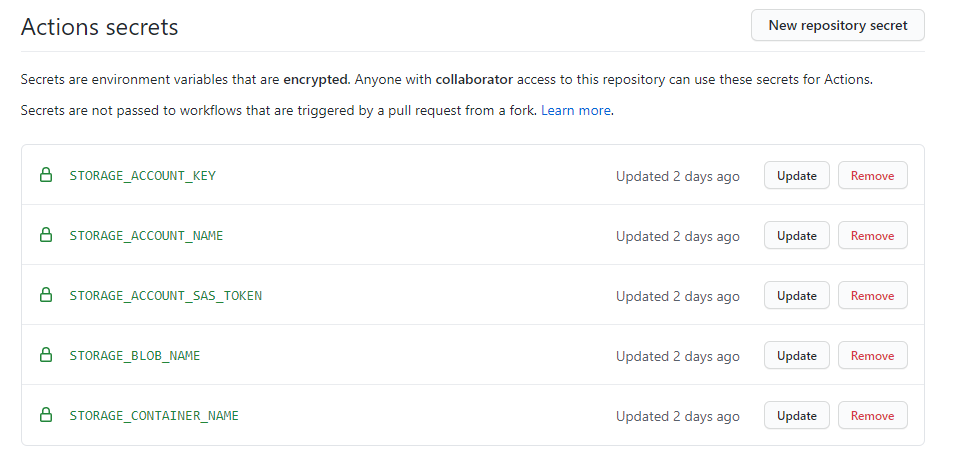

Below the information to enter in the action secrets:

| Variables | Description |
| ---------------------|:-------------|
| STORAGE_ACCOUNT_NAME | Azure Storage Account name used for the tests |
| STORAGE_ACCOUNT_KEY | Azure Storage Account key used for the tests |
| STORAGE_CONTAINER_NAME | Azure Storage Container name used for the tests |
| STORAGE_BLOB_NAME | Azure Storage blob name used for the tests |
| STORAGE_ACCOUNT_SAS_TOKEN | Azure Storage Shared Access Signature Token used for the tests |


Once the pipeline is created on your Github Account, you'll see the following result:

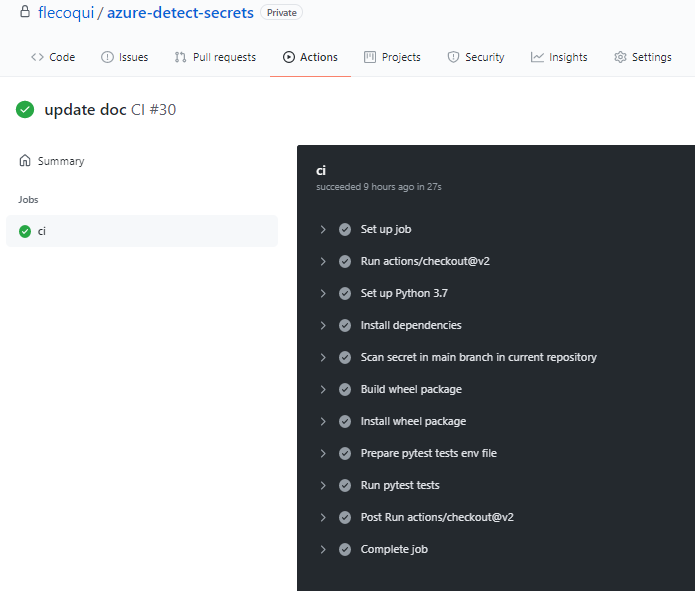

## Detect-secrets Integration Test
In the repository, they are some files which can be used to check whether detect-secrets is fully functionning.
Those files will run first detect-secrets on all the files which need to be scanned in the repository.
Then it will run detect-secrets on all the files which need to be scanned in the repository and also on the files in the folder 'pipelines/detect-secrets/plugins/tests'.
As currently the files in the folder 'pipelines/detect-secrets/plugins/tests' contains 7 secrets, the second secrets scan should detect 7 new   than during the first sercrets scan.

| Files | Description |
| ---------------------|:-------------|
| pipelines/utils/test-detect-secrets.sh | Bash file which will scan first secrets in the repository and then in the files in the folder 'pipelines/detect-secrets/plugins/tests'. When calling this bash file the first argument is the expected number of secrets in the files in the folder 'pipelines/detect-secrets/plugins/tests'. If the number of new secrets after the second pass is equal to this value, the test will be sucessfull.     |
| pipelines/azure-dev-ops/azure-pipelines.test-secrets.yml | Azure DevOps pipeline to test detect-secrets |
| pipelines/github-action/github-action.test-secrets.yml | Github Action DevOps pipeline to test detect-secrets |


## Next steps
So far this repository contains the following components:
- extensions for detect-secrets to detect Azure secrets
- scan-secrets.sh bash file used to detect secrets in a repository
- Azure DevOps pipelines to detect secrets
- Github Actions pipelines to detect secrets
- A dev container with pre-commit hook to prevent developers from committing source code with secrets in a github branch

The current repository can be extended to support new Azure secrets.  
The Azure DevOps pipelines and Github Actions pipelines can also be extended to include Python linting and be triggered when a pull request  review into the main branch is requested.
